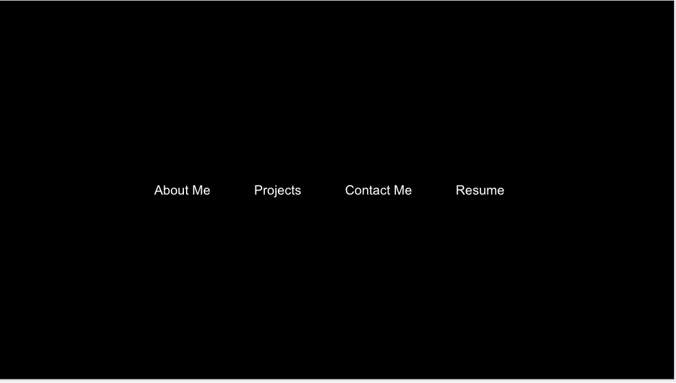
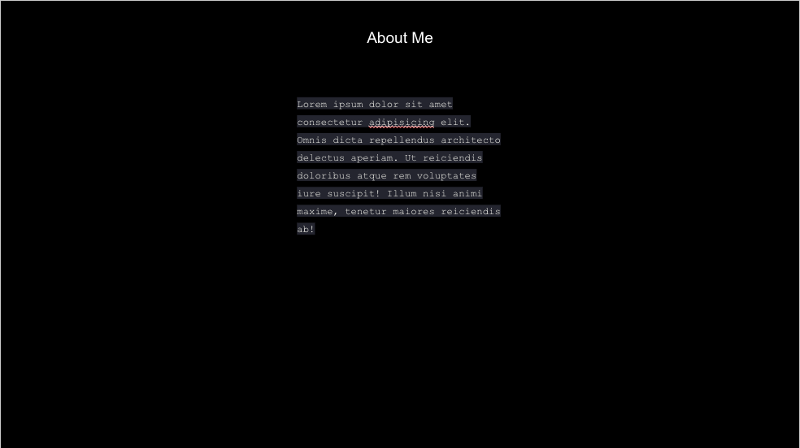
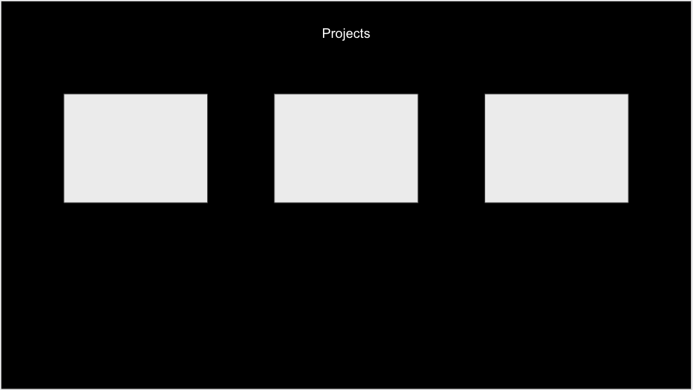
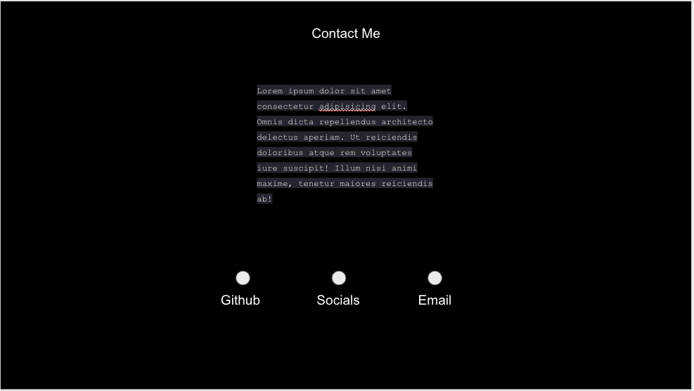
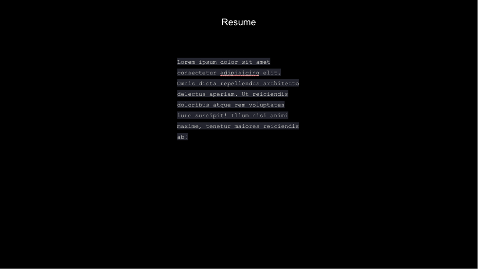

## WireFrames
- 
- 
- 
- 
- 
- 
## Technologies
- HTML
- CSS
- Javascript

### User Stories

As a user I would want to contact the developer so i can get more information on them.
As a user I want to see the work the developer has done to see what the developer is capable of.
As a user I would want to know more about the developer
As a user i would want to access their linked in, git hub, and socials with a click of a button
As a user I would like to see their resume to see the past work
As a user I would like for the page to be organize in sections. Ex. The about me, projects, contact me, resume.

### Stretch Goals
- background image
### MVP
- Built with HTML, CSS, and JavaScript.
- Hosted on Netlify.
- A README.md file with explanations of the technologies used, the approach taken, a link to your live site, installation instructions, unsolved problems, etc.
- Have the the about me, projects, contact me and resume being clickable and take you to that section
- logos of the git, social media pages, etc to be clickable and navigate to the webpage
- A welcome modal and when you click it, it takes me to their home page
- preview box of the projects and when clicked it takes you to the projects
- background webpage animations

## Installation instructions

- click this link to view my site! https://alfredosaenz.netlify.app
